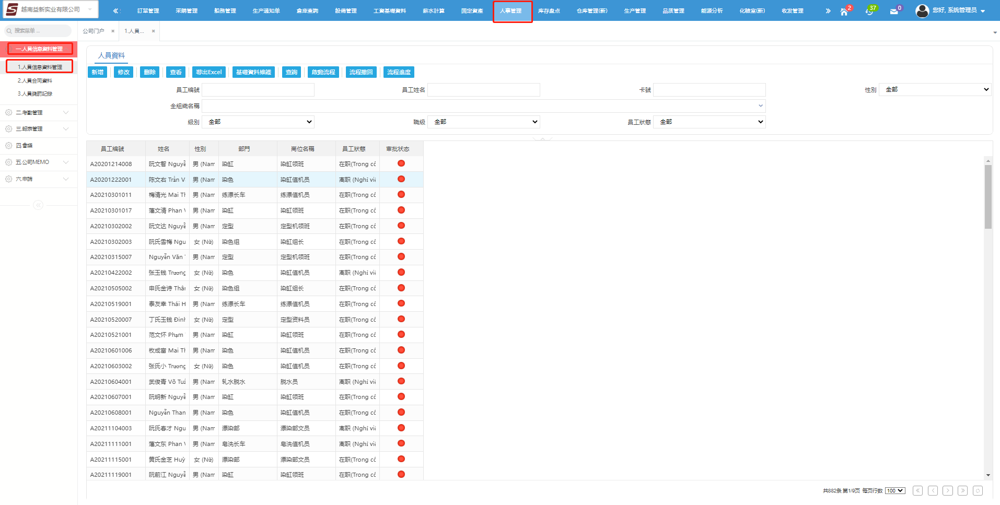
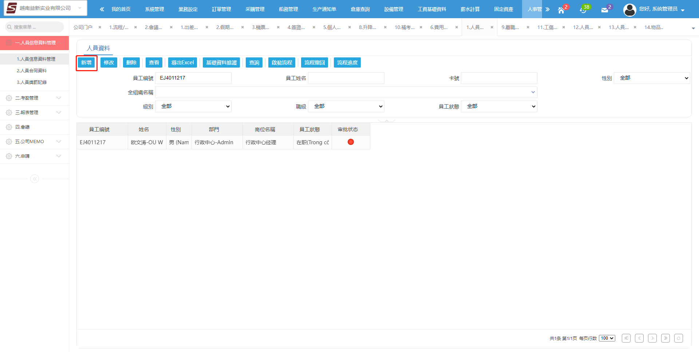
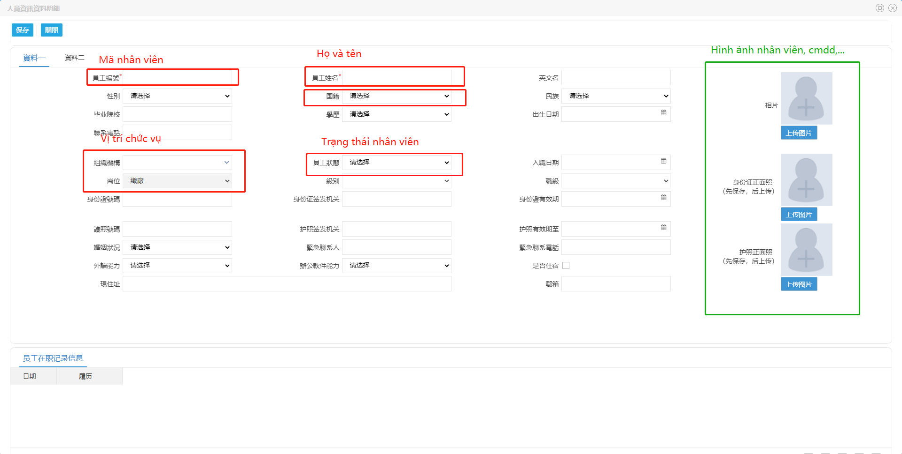
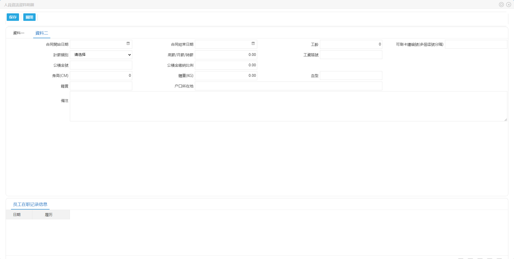
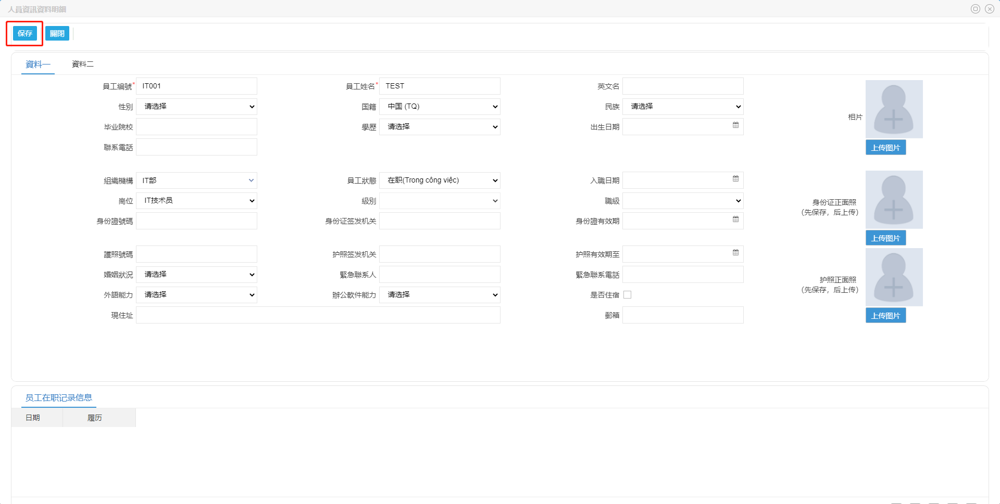
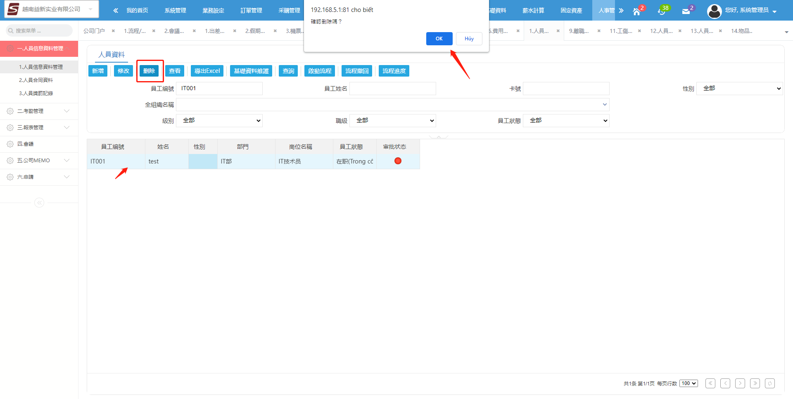
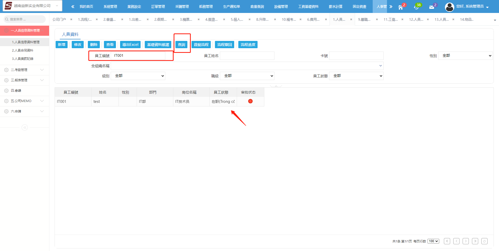
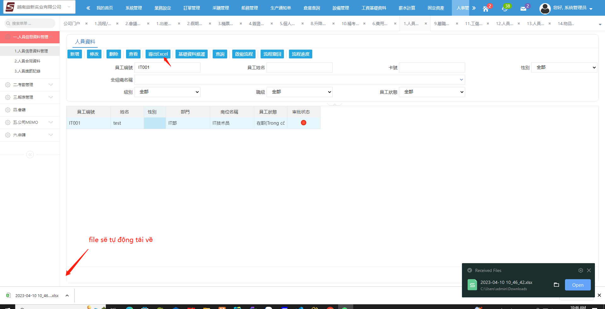
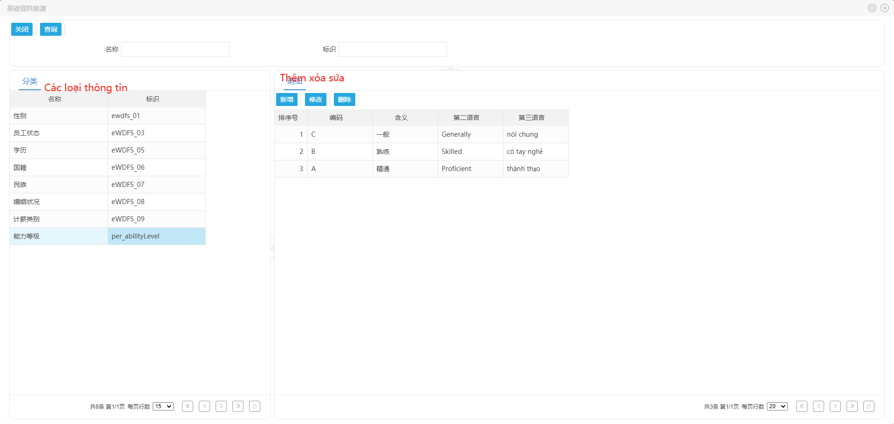

- Thêm nhân viên mới 

Chọn vào nút thêm mới

Điền những thông tin bắt buộc và những thông tin không bắt buộc

Điền thông tin cá nhân 

Xác nhận kết thúc bấm vào nút lưu

- Chỉnh sửa thông tin nhân viên

Để chỉnh sửa thông tin nhân viên bạn có thể click đôi dòng dữ liệu nhân viên cần chỉnh sửa, chỉnh sửa những thông tin và bấm lưu lại

- Xóa nhân viên

Chọn vào hàng dữ liệu cần xóa có thể kết hợp với tra cứu để tìm nhân viên trước, sau đó chọn vào nút xóa và bấm xác nhận để xóa 

- Tra cứu thông tin nhân viên

Nhập thông tin cần tra cứu vào form phía trên và nhấn nút tra cứu kết quả sẽ hiển thị phía bên dưới, nếu kết quả tìm kiếm không có vui lòng kiểm tra lại thông tin trước đó

- Xuất file danh sách

Hệ thống sẽ xuất danh sách nhân viên dựa theo kết quả tra cứu, file sẽ tự động download về trong thư mục tải về

- Chỉnh sửa thông tin cơ bản khác

