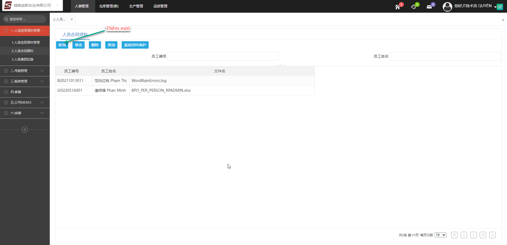
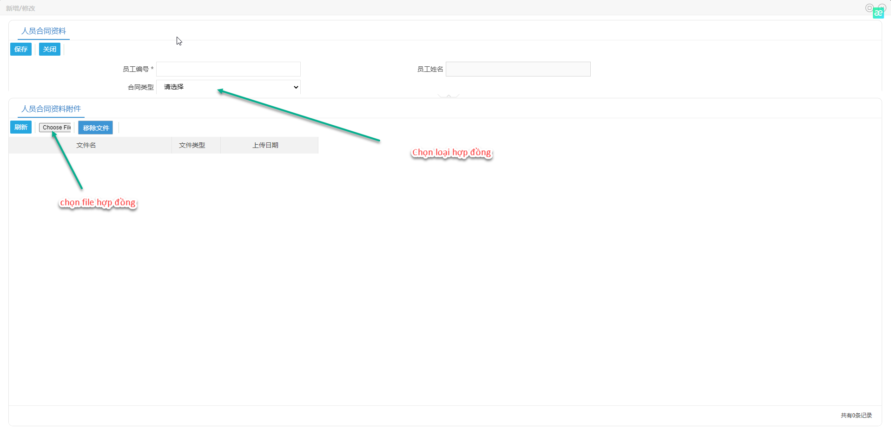
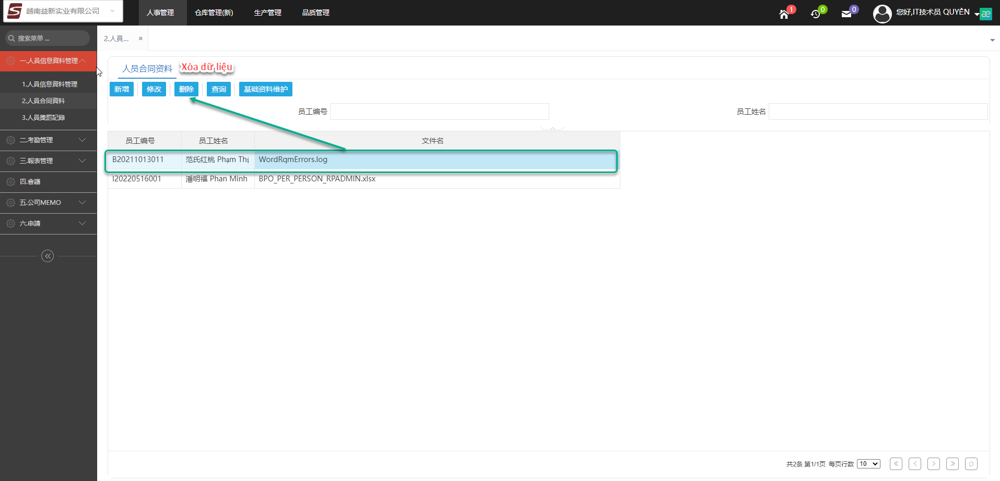
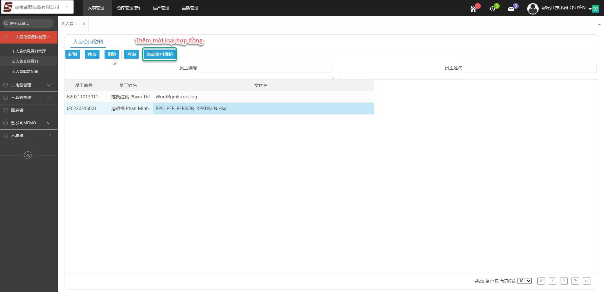
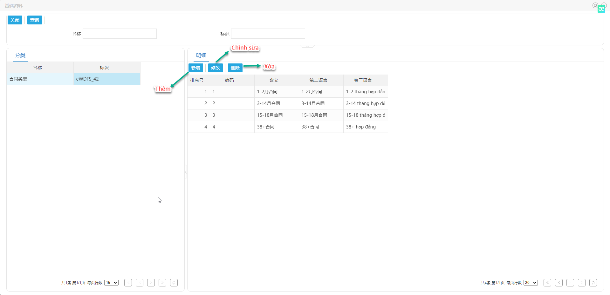

### 1.2.Quản lý hợp đồng

 - Thêm mớ hợp đồng
 Chọn vào nút thêm mới

Điền những thông tin bắt buộc, chọn loại hợp đồng và chọn file

 - Xóa Hợp đồng
Chọn dữ liệu cần xóa và nhấn vào nút xóa

 - Thêm loại hợp đồng
Thêm mới loại hợp đồng nhấn vào nút

 - Thao tác thêm mới, cập nhật và xóa loại hợp đồng
 