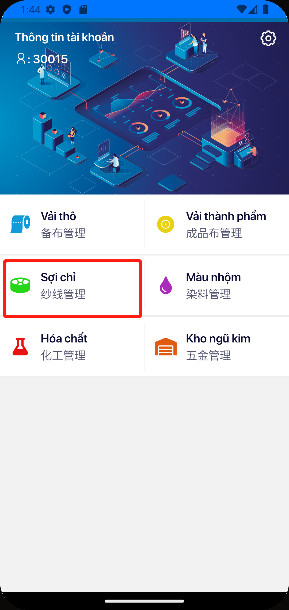
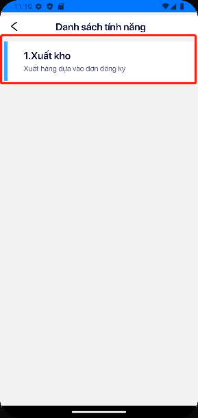
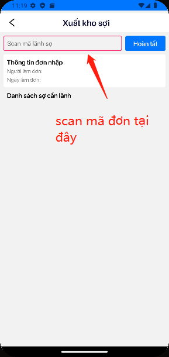
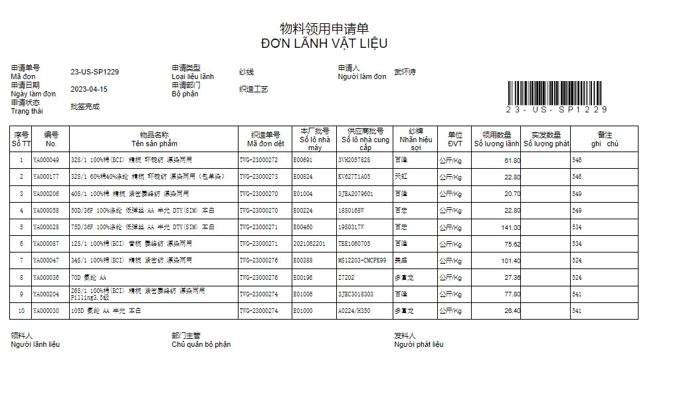
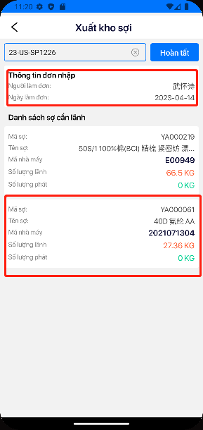
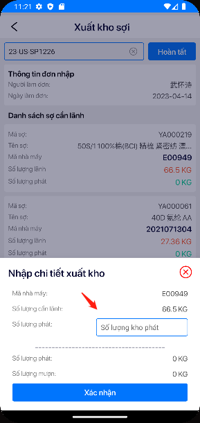
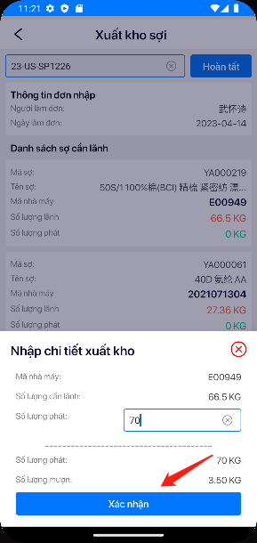
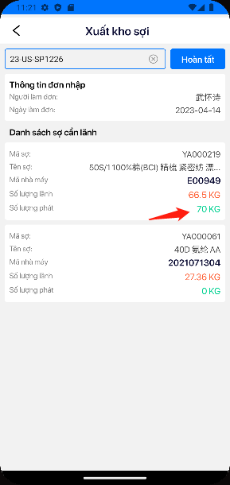
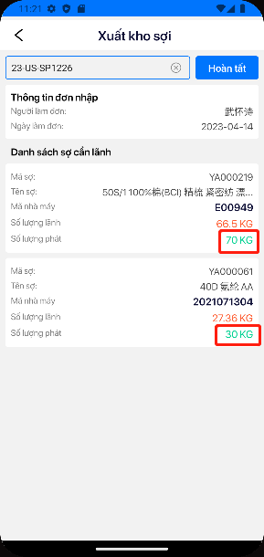
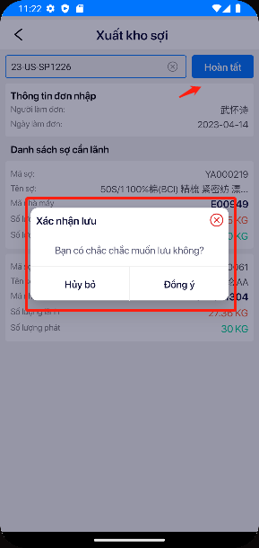

# Tính năng scan xuất kho sợi
- Tại màn hình chính của giao diên
chọn vào nút sợi chỉ

***
- Ở phần này sẽ hiện ra cách danh sách
tính năng.
- Tiếp tục chọn vào tính năng 1.Xuất kho

***

- Sau khi kho nhận đơn lãnh liệu từ xưởng, vui lòng scan mã đơn lãnh liệu vào ô "scan mã lãnh sợi"

***
- Hiển thị ra thông tin đơn đã nhập và danh sách các sợi cần lãnh tương ứng với danh sách "Đơn lãnh vật liệu"

***
Chọn vào đơn

***
- Nhập số lượng chi tiết xuất kho và bấm vào nút xác nhận
- Nếu số lượng phát lớn hơn số lượng lãnh sẽ được trừ ra và tính vào số lượng đã mượn
> **Lưu ý:** 
 > Kiểm tra đầy đủ thông tin trước khi nhập số lượng phát: Mã nhà máy, Số lượng cần lãnh  
 > Nếu số lượng phát là số lẻ thì dùng đâu ".", không dùng dấu ","

***

- Sau khi xác nhận sẽ cập nhật lại số lượng phát 

***

- Chọn và làm tương tự với các phần còn lại 

***
- Sau khi nhập đầy đủ số lượng phát bấm vào nút hoàn thành

***
 **:warning:** Các lỗi thường gặp.
>
 > __`Mã lỗi 227: Không tìm thấy danh sách cần lãnh, xem lại đơn và liên hệ lại bộ phận xưởng để tạo đơn lại.`__ 
 >  
 >  __`Mã lỗi 228: Tính năng chỉ cho phép đơn lãnh sợ, nếu khác loại thì sẽ không thể thao tác được.`__ 